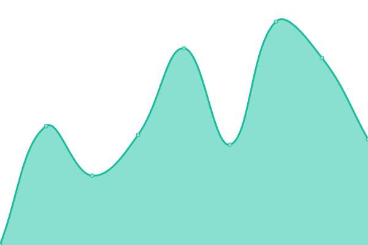

# [📈 Live Status](https://upptime.simonhaas.eu): <!--live status--> **🟩 All systems operational**

This repository contains the open-source uptime monitor and status page for [Upptime](https://upptime.js.org), powered by [Upptime](https://github.com/upptime/upptime).

With [Upptime](https://upptime.js.org), you can get your own unlimited and free uptime monitor and status page, powered entirely by a GitHub repository. We use [Issues](https://github.com/upptime/upptime/issues) as incident reports, [Actions](https://github.com/upptime/upptime/actions) as uptime monitors, and [Pages](https://upptime.simonhaas.eu) for the status page.

<!--start: status pages-->
<!-- This summary is generated by Upptime (https://github.com/upptime/upptime) -->
<!-- Do not edit this manually, your changes will be overwritten -->
<!-- prettier-ignore -->
| URL | Status | History | Response Time | Uptime |
| --- | ------ | ------- | ------------- | ------ |
|  [Homepage](https://www.simonhaas.eu/) | 🟩 Up | [homepage.yml](https://github.com/SimonHaas/upptime/commits/HEAD/history/homepage.yml) | 

 236ms
     
 | 

<a href="https://upptime.simonhaas.eu/history/homepage">100.00%</a>
    

|  [cattle.email](https://www.cattle.email/) | 🟩 Up | [cattle-email.yml](https://github.com/SimonHaas/upptime/commits/HEAD/history/cattle-email.yml) | 

 839ms
     
 | 

<a href="https://upptime.simonhaas.eu/history/cattle-email">100.00%</a>
    

|  [app.cattle.email](https://app.cattle.email) | 🟩 Up | [app-cattle-email.yml](https://github.com/SimonHaas/upptime/commits/HEAD/history/app-cattle-email.yml) | 

 477ms
     
 | 

<a href="https://upptime.simonhaas.eu/history/app-cattle-email">100.00%</a>
    

|  [mail.cattle.email](https://mail.cattle.email/) | 🟩 Up | [mail-cattle-email.yml](https://github.com/SimonHaas/upptime/commits/HEAD/history/mail-cattle-email.yml) | 

 579ms
     
 | 

<a href="https://upptime.simonhaas.eu/history/mail-cattle-email">100.00%</a>
    

|  [authelia.cattle.email](https://authelia.cattle.email) | 🟩 Up | [authelia-cattle-email.yml](https://github.com/SimonHaas/upptime/commits/HEAD/history/authelia-cattle-email.yml) | 

 434ms
     
 | 

<a href="https://upptime.simonhaas.eu/history/authelia-cattle-email">100.00%</a>
    

|  [bum.bayreuth.de](https://bum.bayreuth.de/.well-known/matrix/client) | 🟩 Up | [bum-bayreuth-de.yml](https://github.com/SimonHaas/upptime/commits/HEAD/history/bum-bayreuth-de.yml) | 

 837ms
     
 | 

<a href="https://upptime.simonhaas.eu/history/bum-bayreuth-de">100.00%</a>
    

|  [web.bum.bayreuth.de](https://web.bum.bayreuth.de/) | 🟩 Up | [web-bum-bayreuth-de.yml](https://github.com/SimonHaas/upptime/commits/HEAD/history/web-bum-bayreuth-de.yml) | 

 847ms
     
 | 

<a href="https://upptime.simonhaas.eu/history/web-bum-bayreuth-de">100.00%</a>
    

<!--end: status pages-->

[**Visit our status website →**](https://upptime.simonhaas.eu)

## 📄 License

- Powered by: [Upptime](https://github.com/upptime/upptime)
- Code: [MIT](./LICENSE) © [Anand Chowdhary](https://anandchowdhary.com), supported by [Pabio](https://pabio.com)
- Data in the `./history` directory: [Open Database License](https://opendatacommons.org/licenses/odbl/1-0/)
