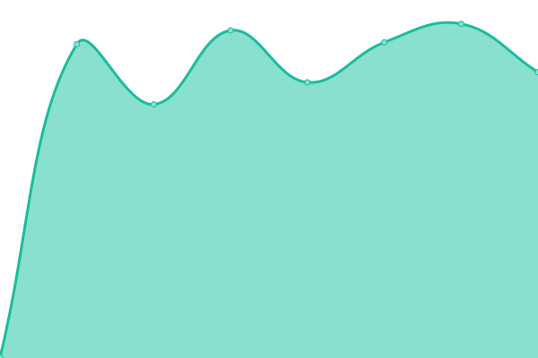

# [📈 Live Status](https://simonhaas.eu): <!--live status--> **🟧 Partial outage**

This repository contains the open-source uptime monitor and status page for [Simon Haas](simonhaas.eu), powered by [Upptime](https://github.com/upptime/upptime).

With [Upptime](https://upptime.js.org), you can get your own unlimited and free uptime monitor and status page, powered entirely by a GitHub repository. We use [Issues](https://github.com/SimonHaas/upptime/issues) as incident reports, [Actions](https://github.com/SimonHaas/upptime/actions) as uptime monitors, and [Pages](https://simonhaas.eu) for the status page.

<!--start: status pages-->
<!-- This summary is generated by Upptime (https://github.com/upptime/upptime) -->
<!-- Do not edit this manually, your changes will be overwritten -->
<!-- prettier-ignore -->
| URL | Status | History | Response Time | Uptime |
| --- | ------ | ------- | ------------- | ------ |
|  [simonhaas.eu](https://www.simonhaas.eu) | 🟩 Up | [simonhaas-eu.yml](https://github.com/SimonHaas/upptime/commits/HEAD/history/simonhaas-eu.yml) | 

 119ms
     
 | 

<a href="https://simonhaas.eu/history/simonhaas-eu">100.00%</a>
    

|  [Blog](https://www.simonhaas.eu/blog) | 🟩 Up | [blog.yml](https://github.com/SimonHaas/upptime/commits/HEAD/history/blog.yml) | 

 58ms
     
 | 

<a href="https://simonhaas.eu/history/blog">100.00%</a>
    

|  [Tallycounter](https://www.simonhaas.eu/tallycounter) | 🟩 Up | [tallycounter.yml](https://github.com/SimonHaas/upptime/commits/HEAD/history/tallycounter.yml) | 

 86ms
     
 | 

<a href="https://simonhaas.eu/history/tallycounter">100.00%</a>
    

|  [Cattle.email](https://www.cattle.email) | 🟩 Up | [cattle-email.yml](https://github.com/SimonHaas/upptime/commits/HEAD/history/cattle-email.yml) | 

 920ms
     
 | 

<a href="https://simonhaas.eu/history/cattle-email">93.50%</a>
    

|  [Cattle.email App](https://app.cattle.email) | 🟩 Up | [cattle-email-app.yml](https://github.com/SimonHaas/upptime/commits/HEAD/history/cattle-email-app.yml) | 

 498ms
     
 | 

<a href="https://simonhaas.eu/history/cattle-email-app">100.00%</a>
    

|  [Cattle.email Mail](https://mail.cattle.email) | 🟩 Up | [cattle-email-mail.yml](https://github.com/SimonHaas/upptime/commits/HEAD/history/cattle-email-mail.yml) | 

 726ms
     
 | 

<a href="https://simonhaas.eu/history/cattle-email-mail">100.00%</a>
    

|  [Cattle.email NPM](https://npm.cattle.email) | 🟩 Up | [cattle-email-npm.yml](https://github.com/SimonHaas/upptime/commits/HEAD/history/cattle-email-npm.yml) | 

 455ms
     
 | 

<a href="https://simonhaas.eu/history/cattle-email-npm">100.00%</a>
    

|  [Bandagecube](https://www.bandagecube.com) | 🟩 Up | [bandagecube.yml](https://github.com/SimonHaas/upptime/commits/HEAD/history/bandagecube.yml) | 

 803ms
     
 | 

<a href="https://simonhaas.eu/history/bandagecube">92.78%</a>
    

|  Lotto Miner | 🟥 Down | [lotto-miner.yml](https://github.com/SimonHaas/upptime/commits/HEAD/history/lotto-miner.yml) | 

 389ms
     
 | 

<a href="https://simonhaas.eu/history/lotto-miner">0.00%</a>
    

<!--end: status pages-->

[**Visit our status website →**](https://simonhaas.eu)

## 📄 License

- Powered by: [Upptime](https://github.com/upptime/upptime)
- Code: [MIT](./LICENSE) © [Anand Chowdhary](https://anandchowdhary.com), supported by [Pabio](https://pabio.com)
- Data in the `./history` directory: [Open Database License](https://opendatacommons.org/licenses/odbl/1-0/)
